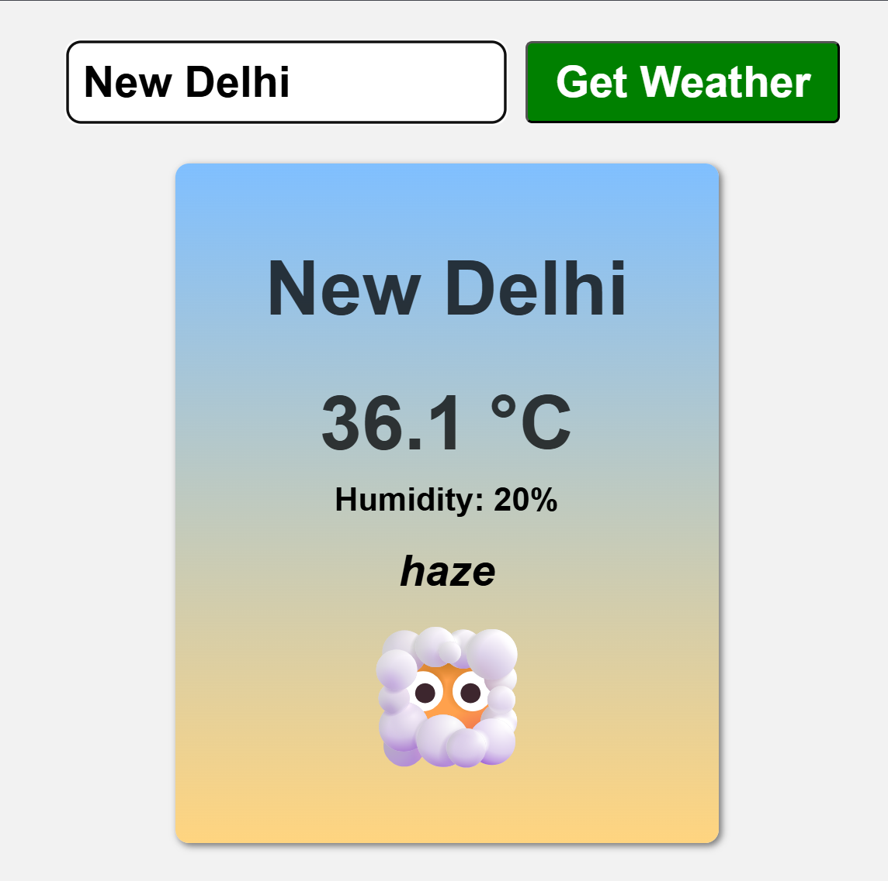

# Weather App (JavaScript, HTML, CSS)

**Repo:** [https://github.com/proy05/weather-app](https://github.com/proy05/weather-app)

**Overview:**
Developed a dynamic **JavaScript**-based web application that retrieves real-time weather updates via the **OpenWeatherMap API**. Users can search for any city to instantly view temperature, humidity, and weather descriptions. The project focuses on handling **asynchronous API requests** using **Fetch and Async/Await**, and dynamically updating the UI through **DOM manipulation**.

**Tools/Software and Processes:**
* **JavaScript (ES6+)** – Async/await, Promises, Fetch API, Object Destructuring, and Template Literals.
* **Web APIs** – RESTful integration with OpenWeatherMap, JSON data handling, and HTTP status management.
* **DOM API** – Dynamic element creation, event handling, and real-time UI updates via class list management.
* **CSS3** – Responsive Flexbox layouts, linear gradients for styling, and interactive transition effects.
* **Error Handling** – Try/Catch implementation for network resilience and custom user feedback for invalid searches.
* **Development Tools** – VS Code, Vite, Live Server, and Browser DevTools for network and console debugging.

---

    <h3>Application Preview:</h3>
    

